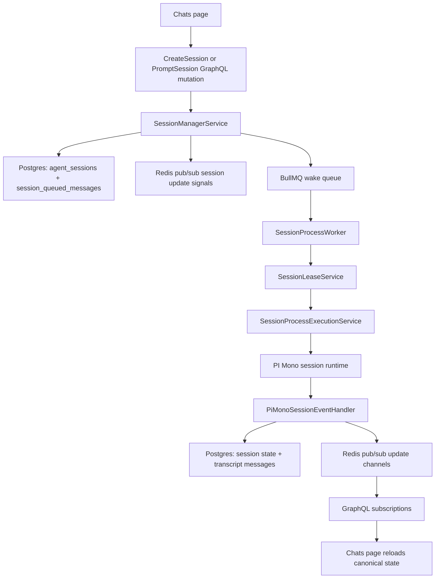

# Chat Message Processing Architecture

This document explains how a chat message sent from the web UI moves through CompanyHelm's API, Redis, BullMQ worker, PI Mono runtime, and back to the browser as live updates.

The important distinction in this codebase is that the web does not stream model output directly from the mutation response. Instead, the system:

1. persists queued user input in Postgres,
2. uses Redis and BullMQ to wake background execution,
3. persists session and transcript updates back to Postgres as the agent runs,
4. uses Redis pub/sub only as a signal channel so GraphQL subscriptions can reload canonical state from Postgres.

## High-level flow

## The browser side

The main web entry point is [chats_page.tsx](/Users/andrea/repos/company-helm/companyhelm-ng/apps/web/src/pages/chats/chats_page.tsx).

There are two ingress paths:

- `startSession()`
  Used when the user starts a brand-new chat.
- `promptSession()`
  Used when the user sends another message to an existing session.

For a new session, `startSession()` calls the `CreateSession` GraphQL mutation defined in [create_session.ts](/Users/andrea/repos/company-helm/companyhelm-ng/apps/api/src/graphql/mutations/create_session.ts).

For an existing session, `promptSession()` calls the `PromptSession` GraphQL mutation defined in [prompt_session.ts](/Users/andrea/repos/company-helm/companyhelm-ng/apps/api/src/graphql/mutations/prompt_session.ts).

The web also keeps three live GraphQL subscriptions open on the chats page:

- `SessionUpdated`
  Session-level state such as `status`, `isThinking`, `thinkingText`, and title fields.
- `SessionMessageUpdated`
  Transcript messages for the selected session.
- `SessionQueuedMessagesUpdated`
  The queued-message strip shown above the composer.

The subscription transport is a shared `graphql-ws` socket created by [graphql_subscription_client.ts](/Users/andrea/repos/company-helm/companyhelm-ng/apps/web/src/lib/graphql_subscription_client.ts) and wired into Relay in [relay_environment.ts](/Users/andrea/repos/company-helm/companyhelm-ng/apps/web/src/lib/relay_environment.ts).

## GraphQL ingress

`CreateSessionMutation` and `PromptSessionMutation` are thin validation layers. They both delegate the real work to [SessionManagerService](/Users/andrea/repos/company-helm/companyhelm-ng/apps/api/src/services/agent/session/session_manager_service.ts).

### New session

`SessionManagerService.createSession()`:

1. creates an `agent_sessions` row,
2. resolves the selected or default model,
3. stores the first user prompt in `session_queued_messages`,
4. optionally stores queued images in `session_queued_message_images`,
5. calls `notifyQueuedSessionMessage()`.

The inserted session starts in `queued` status because the mutation is only the ingress step. The actual model execution happens later in the background worker.

### Existing session

`SessionManagerService.prompt()`:

1. updates the `agent_sessions` row with the selected model and reasoning level,
2. keeps status as `running` if the session is already running, otherwise uses `queued`,
3. inserts a new row into `session_queued_messages`,
4. optionally inserts queued images,
5. calls `notifyQueuedSessionMessage()`.

This means the mutation path is durable and quick: the browser gets confirmation once the prompt is queued, not when the model finishes.

## What `notifyQueuedSessionMessage()` does

`SessionManagerService.notifyQueuedSessionMessage()` is the handoff point between synchronous GraphQL ingress and asynchronous execution.

It does three things:

1. publishes a queued-messages update signal,
2. publishes a session update signal,
3. enqueues a BullMQ wake job for the session.

If the queued message is marked as steer, it also publishes a steer signal.

Those names come from:

- [pub_sub_names.ts](/Users/andrea/repos/company-helm/companyhelm-ng/apps/api/src/services/agent/session/process/pub_sub_names.ts)
- [queued_names.ts](/Users/andrea/repos/company-helm/companyhelm-ng/apps/api/src/services/agent/session/process/queued_names.ts)

The Redis channels involved are:

- `session:{sessionId}:queued:update`
- `session:{sessionId}:update`
- `session:{sessionId}:steer`
- `session:{sessionId}:interrupt`

The BullMQ wake queue name is:

- `agent-session-process`

## Redis responsibilities

Redis has three different roles in this flow.

### 1. BullMQ transport

[queue.ts](/Users/andrea/repos/company-helm/companyhelm-ng/apps/api/src/services/agent/session/process/queue.ts) uses BullMQ to enqueue one wake job per session event that needs background processing.

This is not the transcript transport. It is only the job queue that wakes a worker.

### 2. Session lease coordination

[lease.ts](/Users/andrea/repos/company-helm/companyhelm-ng/apps/api/src/services/agent/session/process/lease.ts) stores a short-lived Redis lease key per session. That guarantees only one worker execution pass owns a session at a time, even if multiple wake jobs arrive close together.

The lease key format is:

- `company:{companyId}:session:{sessionId}:lease`

### 3. Pub/sub fanout

Redis pub/sub is used as a signal bus for:

- session row changes,
- transcript message changes,
- queued-message strip changes,
- steer nudges,
- interrupts.

The important detail is that pub/sub payloads are intentionally minimal. Subscribers do not trust Redis as the source of truth. They receive a signal, then reload the canonical row or list from Postgres.

## Worker execution

The worker entry point is [session_process.ts](/Users/andrea/repos/company-helm/companyhelm-ng/apps/api/src/workers/session_process.ts).

The actual execution logic lives in [execution.ts](/Users/andrea/repos/company-helm/companyhelm-ng/apps/api/src/services/agent/session/process/execution.ts).

For each wake job:

1. acquire the Redis lease for the session,
2. read processable queued messages from Postgres,
3. pick the primary batch to execute,
4. load runtime config from Postgres,
5. load company settings,
6. ensure a PI Mono session runtime exists,
7. subscribe to steer and interrupt Redis channels,
8. mark queued messages as `processing`,
9. prompt PI Mono with the combined text and images,
10. delete processed queued rows on success or move them back to `pending` on failure,
11. release the lease,
12. enqueue a follow-up wake job if more queued rows remain.

The worker is intentionally stateless across jobs. Postgres holds the durable queue, and Redis only coordinates execution and update fanout.

## PI Mono runtime boundary

`SessionProcessExecutionService` hands control to [PiMonoSessionManagerService](/Users/andrea/repos/company-helm/companyhelm-ng/apps/api/src/services/agent/session/pi-mono/session_manager_service.ts).

`ensureSession()` builds the in-memory PI Mono runtime for the `sessionId`. That setup includes:

- model auth and model registry,
- agent tools,
- environment prompt scope,
- system prompt layers,
- a [PiMonoSessionEventHandler](/Users/andrea/repos/company-helm/companyhelm-ng/apps/api/src/services/agent/session/pi-mono/session_event_handler.ts) subscribed to all PI events.

`prompt()` then:

1. starts a prompt turn in the event handler,
2. calls `session.prompt(...)` on the PI runtime,
3. lets PI emit incremental events,
4. persists final context messages after the turn completes.

## How transcript and status updates are produced

[PiMonoSessionEventHandler](/Users/andrea/repos/company-helm/companyhelm-ng/apps/api/src/services/agent/session/pi-mono/session_event_handler.ts) is the persistence bridge between PI runtime events and the rest of the app.

It is responsible for:

- inserting or updating transcript messages,
- tracking tool-call messages,
- persisting `isThinking` and `thinkingText`,
- persisting context snapshot fields such as token counts,
- publishing Redis update signals after the durable write completes.

Two important patterns matter here.

### Session state updates

Thinking events update the `agent_sessions` row first, then call `publishSessionUpdate()`.

That is why the web can show:

- queued,
- running,
- thinking,
- stopped,
- updated title,
- token counts

without polling.

### Transcript message updates

Message events are persisted first, then the handler publishes:

- `session:{sessionId}:message:{messageId}:update`

The web does not consume the raw event body from Redis. It receives the signal through GraphQL subscription and reloads the message from Postgres.

## How GraphQL subscriptions turn Redis signals into UI updates

The subscription server setup lives in [graphql_application.ts](/Users/andrea/repos/company-helm/companyhelm-ng/apps/api/src/graphql/graphql_application.ts).

For an authenticated websocket subscription:

1. GraphQL resolves auth and company-scoped DB access,
2. it creates a company-scoped Redis helper,
3. the subscription resolver listens on the appropriate Redis channel pattern,
4. on every Redis signal, it reloads canonical state from Postgres,
5. it yields that hydrated object or list back to the websocket client.

The async-iterator bridge is [redis_pattern_async_iterator.ts](/Users/andrea/repos/company-helm/companyhelm-ng/apps/api/src/graphql/subscriptions/redis_pattern_async_iterator.ts).

The concrete subscription resolvers are:

- [session_updated.ts](/Users/andrea/repos/company-helm/companyhelm-ng/apps/api/src/graphql/resolvers/session_updated.ts)
- [session_message_updated.ts](/Users/andrea/repos/company-helm/companyhelm-ng/apps/api/src/graphql/resolvers/session_message_updated.ts)
- [session_queued_messages_updated.ts](/Users/andrea/repos/company-helm/companyhelm-ng/apps/api/src/graphql/resolvers/session_queued_messages_updated.ts)

Each resolver reloads from Postgres instead of trusting pub/sub payloads.

That design gives two benefits:

- the browser always sees the persisted canonical view,
- reconnects do not require rebuilding local state from missed ephemeral Redis payloads.

## What the user sees in practice

From the browser's perspective, one message send usually looks like this:

1. user presses send,
2. the mutation returns quickly after durable queue ingress,
3. the queued-message strip updates,
4. the session row updates to `queued` or stays `running`,
5. the background worker picks up the wake job,
6. the session becomes thinking or running,
7. transcript messages appear incrementally as persisted message rows,
8. queued rows disappear once processed,
9. the session updates again when the turn finishes.

The web experiences this as streaming, but the actual architecture is:

- persist input,
- wake background work,
- persist output,
- signal subscribers,
- reload canonical state.

## Why the system is built this way

This design avoids coupling the browser directly to long-running model execution.

The main tradeoffs are:

- Postgres is the source of truth for session and transcript state.
- Redis is coordination and signaling, not durable message storage.
- BullMQ handles background wake scheduling, not transcript delivery.
- GraphQL subscriptions push invalidation-style signals whose payloads are rehydrated from Postgres.

That separation makes the system more resilient to:

- browser reconnects,
- worker restarts,
- duplicated wake jobs,
- missed pub/sub events,
- long-running agent turns.
