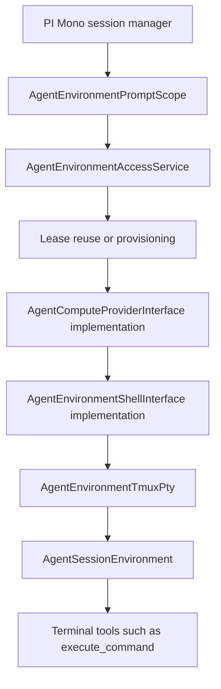

# Environment And Terminal Execution Architecture

This document explains the classes and interfaces involved in environment selection, provisioning, leasing, and terminal command execution for agent sessions. The important distinction in this codebase is that "environment management" and "`execute_command`" are not the same layer.

`execute_command` is the agent-facing tool. It runs on top of a leased environment, which itself runs on top of a provider shell, which itself runs on top of a compute provider such as E2B.

## High-level flow

For a new prompt run, the flow is:

1. `PiMonoSessionManagerService` creates one `AgentEnvironmentPromptScope`.
2. The first terminal-related tool call asks the prompt scope for an environment.
3. `AgentEnvironmentAccessService` either:
   - reuses the session's previous environment lease,
   - reuses another healthy environment from the agent's history, or
   - provisions a new environment.
4. The selected provider creates a raw shell adapter.
5. `AgentEnvironmentTmuxPty` turns that raw shell into tmux-backed terminal sessions.
6. `AgentSessionEnvironment` wraps the PTY with lease ownership and session secret injection.
7. `execute_command`, `send_pty_input`, `read_pty_output`, and the other terminal tools call into that leased environment.

## The four execution layers

The clearest way to understand the code is to separate four interfaces that look similar but serve different purposes.

### 1. Provider lifecycle: `AgentComputeProviderInterface`

File: `apps/api/src/services/agent/compute/provider_interface.ts`

This is the lifecycle boundary for real compute backends. It is responsible for:

- provisioning a new environment,
- checking live environment status,
- starting and stopping provider environments,
- deleting provider environments,
- creating a raw shell adapter for an already selected environment row.

Concrete implementation:

- `AgentComputeE2bProvider`

This layer knows about provider APIs, persisted provider definitions, and provider environment ids. It does not know about tmux sessions or agent terminal tools.

### 2. Raw remote command execution: `AgentEnvironmentShellInterface`

File: `apps/api/src/services/agent/compute/shell_interface.ts`

This is the smallest possible provider-agnostic shell primitive:

- run one remote command,
- optionally set cwd,
- optionally set environment variables,
- optionally set a timeout,
- return combined text output and exit code.

Concrete implementation:

- `AgentComputeE2bShell`

This layer does not provide persistent interactive terminal sessions. It is just enough to bootstrap and control a higher-level PTY mechanism.

### 3. Terminal session management: `AgentEnvironmentPtyInterface`

File: `apps/api/src/services/agent/compute/pty_interface.ts`

This is the reusable PTY/session layer used by the terminal tools. It adds concepts that the raw shell layer does not have:

- session ids,
- `executeCommand` inside a session,
- `sendInput` to an existing session,
- `readOutput` paging,
- session listing,
- resize,
- kill and close semantics.

Current implementation:

- `AgentEnvironmentTmuxPty`

This layer is where the agent gets persistent shell state. In the current design, tmux is the provider-agnostic PTY backend.

### 4. Leased environment handle: `AgentEnvironmentInterface`

File: `apps/api/src/services/agent/compute/environment_interface.ts`

This is the object exposed to tools during a prompt run. It looks similar to the PTY interface, but it adds lease ownership concerns:

- keeps the environment lease alive while the prompt run is active,
- injects session secrets into `executeCommand`,
- releases the lease back to warm idle on `dispose()`.

Current implementation:

- `AgentSessionEnvironment`

This is the last layer before the tool surface.

## Environment orchestration classes

These classes decide which environment exists and who currently owns it.

### `AgentEnvironmentPromptScope`

File: `apps/api/src/services/agent/environment/prompt_scope.ts`

This is a per-prompt cache. Multiple tool calls in one prompt reuse the same leased environment object. When the prompt scope is disposed, it disposes the leased environment and returns its lease to idle.

Use this to answer the question "why do multiple tool calls in one agent turn hit the same environment without reacquiring it?"

### `AgentEnvironmentAccessService`

File: `apps/api/src/services/agent/environment/access_service.ts`

This is the main environment entry point for tools. It:

- validates that the session belongs to the agent,
- expires stale leases,
- tries to reactivate the session's current open lease,
- falls back to environment reuse from lease history,
- falls back again to on-demand provisioning,
- acquires or reactivates the lease,
- creates the provider shell,
- wraps the shell in `AgentEnvironmentTmuxPty`,
- wraps the PTY in `AgentSessionEnvironment`.

If you want to know "where does a tool call turn into a leased environment object?", this is the answer.

### `AgentEnvironmentSelectionService`

File: `apps/api/src/services/agent/environment/selection_service.ts`

This is the reuse policy. It does not provision anything. It searches lease history in this order:

1. recent lease history for the current session,
2. broader lease history for the agent.

It refuses to reuse environments that:

- are still covered by an open lease,
- are missing from the catalog,
- are unhealthy according to the provider.

### `AgentEnvironmentProvisioningService`

File: `apps/api/src/services/agent/environment/provisioning_service.ts`

This is the on-demand creation path used when reuse fails. It:

- loads the agent's default compute provider definition,
- resolves environment requirements,
- asks the selected provider to provision compute,
- persists the resulting environment row in the catalog,
- runs shared post-create provisioning,
- cleans up provider state if anything fails after creation.

This is the orchestration layer for provisioning. It is not the provider implementation itself.

### `AgentEnvironmentProvisioning`

File: `apps/api/src/services/agent/environment/provisioning.ts`

This class applies shared post-create bootstrap steps after provider creation succeeds. Right now it ensures the shared agent workspace exists at `~/workspace`.

This class is intentionally provider-agnostic. Provider creation and provider lifecycle stay in the provider implementation; shared filesystem assumptions live here instead.

### `AgentEnvironmentCatalogService`

File: `apps/api/src/services/agent/environment/catalog_service.ts`

This is the durable environment row service. It stores environment identity and resource metadata, including:

- provider,
- provider definition id,
- provider environment id,
- CPU, memory, disk, platform,
- metadata and timestamps.

It does not own lease state. That separation matters because environment identity and lease ownership evolve on different timelines.

### `AgentEnvironmentLeaseService`

File: `apps/api/src/services/agent/environment/lease_service.ts`

This is the source of truth for session ownership of environments. It handles:

- acquire,
- activate,
- heartbeat,
- idle transition,
- release,
- expiry,
- lease history queries.

The important behavior difference is:

- an environment row says "this environment exists",
- a lease row says "this session currently owns or recently owned it".

### `AgentEnvironmentRequirementsService`

File: `apps/api/src/services/agent/environment/requirements_service.ts`

This resolves the minimum compute shape for provisioning. It returns persisted per-agent requirements when they exist, otherwise product defaults. It also validates updates against provider-specific limits.

### `AgentEnvironmentWorkspacePath`

File: `apps/api/src/services/agent/environment/workspace_path.ts`

This centralizes the logical agent workspace path. The current shared path is `~/workspace`, which deliberately avoids provider-specific absolute paths such as `/workspace`.

## Terminal execution classes

These classes are specific to live shell interaction after an environment has already been selected.

### `AgentTerminalToolProvider`

File: `apps/api/src/services/agent/tools/terminal/provider.ts`

This groups the terminal-related tools behind one provider so the overall tool catalog can register them as a unit.

It wires:

- `list_pty_sessions`
- `execute_command`
- `send_pty_input`
- `read_pty_output`
- `resize_pty`
- `kill_session`
- `close_session`
- `apply_patch`

### `AgentExecuteCommandTool`

File: `apps/api/src/services/agent/tools/terminal/execute_command.ts`

This is the agent-facing tool for command execution. It:

- asks the prompt scope for the leased environment,
- calls `environment.executeCommand(...)`,
- returns formatted output and the session id.

Important behavior:

- omitting `sessionId` uses the default session name `main`,
- the tool surface exposes `yield_time_ms`, not a first-class `timeoutMs` argument,
- it runs inside a tmux session, not as a raw one-shot provider shell command.

### `AgentSendTerminalInputTool`

File: `apps/api/src/services/agent/tools/terminal/send_input.ts`

This is for continuing interaction with an existing tmux session. Use it when a shell is already running and the agent needs to type more input rather than start a fresh command file.

### `AgentReadTerminalOutputTool`

File: `apps/api/src/services/agent/tools/terminal/read_output.ts`

This paginates tmux pane output by character offsets. It exists so the API process does not need to maintain a separate PTY transcript buffer.

### `AgentListTerminalSessionsTool`

File: `apps/api/src/services/agent/tools/terminal/list_sessions.ts`

This lists tmux sessions visible inside the leased environment so the agent can choose which session id to reuse.

### `AgentResizeTerminalSessionTool`

File: `apps/api/src/services/agent/tools/terminal/resize_session.ts`

This updates the tmux window size for an existing session so interactive terminal applications can respond to viewport changes.

### `AgentKillTerminalSessionTool` and `AgentCloseTerminalSessionTool`

Files:

- `apps/api/src/services/agent/tools/terminal/kill_session.ts`
- `apps/api/src/services/agent/tools/terminal/close_session.ts`

Right now both end up killing the tmux session. The naming difference is semantic:

- `kill_session` means immediate termination,
- `close_session` means the agent is intentionally done with that shell state.

### `AgentSessionEnvironment`

File: `apps/api/src/services/agent/environment/session_environment.ts`

This is the leased environment object used by the tools. It:

- starts a background lease heartbeat,
- merges session secret environment variables into `executeCommand`,
- delegates terminal work to the PTY implementation,
- marks the lease idle on dispose.

This class is the bridge between environment leasing and terminal execution.

### `AgentEnvironmentTmuxPty`

File: `apps/api/src/services/agent/compute/tmux_pty.ts`

This is the core terminal execution engine. It uses a generic remote shell to manage tmux. Its responsibilities are:

- ensure tmux is installed,
- create or reuse tmux sessions,
- write command wrapper scripts into `/tmp/companyhelm`,
- capture pane output,
- poll for rc files to detect command completion,
- page output,
- list sessions,
- resize and kill sessions,
- expand `~` against the remote `$HOME`,
- keep helper command timeouts safely above the requested `yield_time_ms`.

The key design choice is that the terminal layer is provider-agnostic. It only depends on `AgentEnvironmentShellInterface`.

### `AgentEnvironmentShellPrivilegeProbe`

File: `apps/api/src/services/agent/compute/shell_privilege_probe.ts`

This helper detects whether the remote shell is:

- already root,
- allowed to run passwordless sudo,
- or fully unprivileged.

`AgentEnvironmentTmuxPty` uses it when tmux is missing and needs to be installed. Keeping this helper generic avoids hardcoding E2B assumptions into the PTY layer.

## Provider implementations and their differences

The provider implementations follow the same interfaces, but the details differ.

### `AgentComputeE2bProvider`

File: `apps/api/src/services/agent/compute/e2b/e2b_provider.ts`

This class maps the provider contract onto E2B sandboxes. It:

- provisions sandboxes with auto-resume and pause-on-timeout lifecycle settings,
- looks up live status through E2B,
- pauses instead of deleting the environment when asked to stop,
- kills missing environments defensively,
- creates an E2B shell adapter.

Notable behavior:

- it uses a one-hour sandbox lifecycle timeout when creating or connecting to a sandbox,
- it loads credentials from the runtime compute provider definition.

### `AgentComputeE2bShell`

File: `apps/api/src/services/agent/compute/e2b/e2b_shell.ts`

This adapter calls `sandbox.commands.run(...)` and normalizes E2B command failures into the shared shell contract instead of throwing when the command merely exits non-zero.

Notable behavior:

- it passes per-command timeout through as `timeoutMs`,
- it combines stdout and stderr into one returned text stream,
- it preserves non-zero exit codes for the caller instead of treating them as exceptional control flow.

## The most important differences to keep straight

### `execute_command` vs raw provider shell execution

`execute_command` does not call E2B directly. It goes through:

1. `AgentExecuteCommandTool`
2. `AgentEnvironmentPromptScope`
3. `AgentEnvironmentAccessService`
4. `AgentSessionEnvironment`
5. `AgentEnvironmentTmuxPty`
6. `AgentEnvironmentShellInterface`
7. provider SDK

By contrast, `AgentEnvironmentShellInterface.executeCommand(...)` is the lower-level primitive used by the tmux implementation itself.

### `AgentEnvironmentInterface` vs `AgentEnvironmentPtyInterface`

These look similar, but they solve different problems:

- `AgentEnvironmentPtyInterface` is about terminal session mechanics,
- `AgentEnvironmentInterface` is about exposing those mechanics through a leased environment handle.

The latter adds lease ownership and secret injection. The former does not.

### `ProvisioningService` vs `Provisioning`

These names are close, but the responsibilities are different:

- `AgentEnvironmentProvisioningService` decides when and how to create a new environment row and provider environment,
- `AgentEnvironmentProvisioning` performs shared post-create bootstrapping inside the newly created environment.

### `CatalogService` vs `LeaseService`

These are intentionally separate:

- catalog tracks durable environment identity,
- lease service tracks transient ownership and reuse history.

Mixing those concerns would make environment reuse and cleanup much harder to reason about.

### `send_pty_input` vs `read_pty_output`

Both target an existing session, but:

- `send_pty_input` mutates terminal state and optionally waits for more output,
- `read_pty_output` is read-only and pages the current pane transcript from an offset.

## Why tmux exists in the middle

E2B is not exposed directly to the agent as a persistent shell abstraction. The codebase deliberately inserts tmux between the raw provider shell and the tool layer so that:

- session ids are stable across multiple tool calls,
- long-running commands can continue after a short yield,
- output can be paged later,
- the provider-specific shell adapters stay minimal,
- the terminal behavior is shared across compute providers.

That is the main architectural choice behind the current design.
